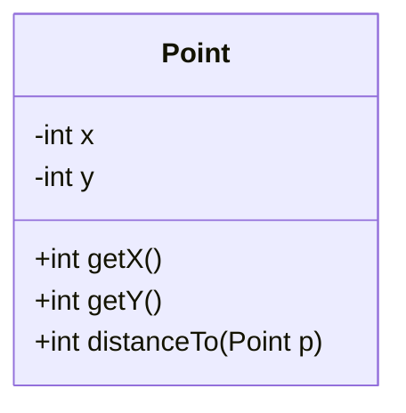
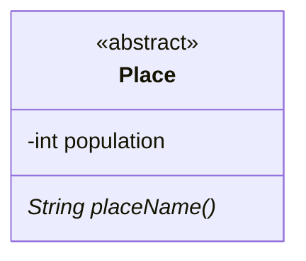
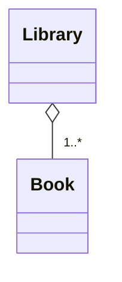
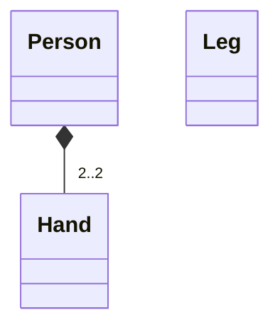

## Week 1 - Intro; Semester 1 Recap; OOP Basics

## Week 2 - Challenges in SE; Coupling and Cohesion

Challenge 1: Scale

- No way any one person can fully understand all that code

  - Research suggest that around 10000 lines (of well designed code) max

- Necessitates:
  - Techniques to deal with complexity
  - Working in teams

Challenge 2: Change

The agile techniques are all about change

Abstraction as a Fundamental Technique to handle Scale

Example:

- Using List over ArrayList
  - List is a general "thing"
- ArrayList has much more detail

## Week 3 - Advanced OOP: Controlling Coupling/Cohesion

## Week 4 - UML

UML stands for Unified Modeling Language.

### Class Diagrams

Classes have three elements:

- A name
- Instance Variables
- Methods

| Visibility        | Symbol | Meaning           |
| ----------------- | ------ | ----------------- |
| Private           | -      | Class only        |
| Package Protected | ~      | Package Protected |
| Protected         | #      | Class/children    |
| Public            | +      | Anyone            |

### Abstract Classes in UML

- Abstract class and method is the same as a class, but with the name in **_italics_**

> Since I'm using Mermaid, annotations are used with `<<annotation>>` , so the diagram here is not exactly italicized, but the general rule stands.

### Aggregation (Built From)

- Clear diamond means _"part of"_

  - A Book is part of a Library
  - A Library _has_ a (collection of) Book(s)

- Weak dependency
  - A Book is still a book without a Library
  - Contrast to an account without a bank for example

### Composition (Strongly Built From)

## Week 5 - Testing

## Week 6 - Error handling, Safe Classes, and Packages

## Week 7 - Live Code Refactoring Example

## Week 8 - Design Patterns 1

## Week 9 - Design Patterns 2

## Week 10 - Looking Forward: What a SE should know

## Week 11 - Revision and Exam Prep with Gul + Blair

## Software Engineering Challenges

## Developer Roles

Code-Owner: The person (or team) developing a particular component.

Code-User: The person (or team) using a particular component.

Don't need to know everything, an abstract model of what happens is enough.

### Ownership

Important to be aware of ownership

### Coupling and Cohesion

Q: How do we best split up a program into component?
Q: What makes a good component?

We want high cohesion and low coupling.

High Cohesion:

- Internas of components should be related.

  - e.g. you don't expect the database connector to be inside the HTML rendering function

- Components should do one thing well

Low Coupling:
Internal details should not leak between components, if they do, `change` becomes very difficult.
