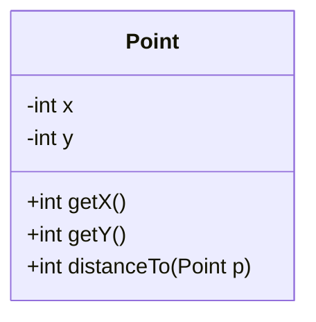
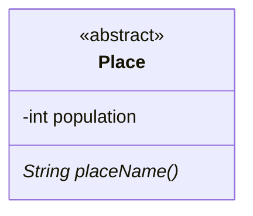
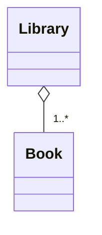
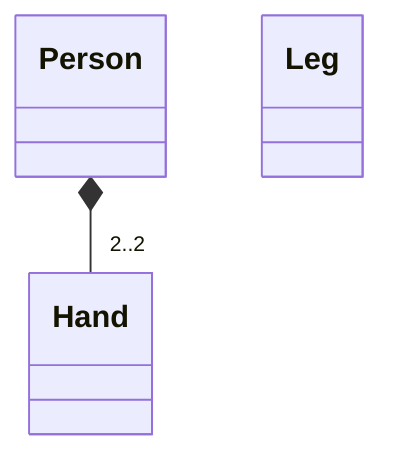

## Week 1 - Intro; Semester 1 Recap; OOP Basics

## Week 2 - Challenges in SE; Coupling and Cohesion

Challenge 1: Scale

- No way any one person can fully understand all that code

  - Research suggest that around 10000 lines (of well designed code) max

- Necessitates:
  - Techniques to deal with complexity
  - Working in teams

Challenge 2: Change

The agile techniques are all about change

Abstraction as a Fundamental Technique to handle Scale

Example:

- Using List over ArrayList
  - List is a general "thing"
- ArrayList has much more detail

### Software Engineering Challenges

### Developer Roles

Code-Owner: The person (or team) developing a particular component.

Code-User: The person (or team) using a particular component.

Don't need to know everything, an abstract model of what happens is enough.

### Ownership

Important to be aware of ownership

### Coupling and Cohesion

Q: How do we best split up a program into component?
Q: What makes a good component?

We want high cohesion and low coupling.

High Cohesion:

- Internas of components should be related.

  - e.g. you don't expect the database connector to be inside the HTML rendering function

- Components should do one thing well

Low Coupling:
Internal details should not leak between components, if they do, `change` becomes very difficult.

## Week 3 - Advanced OOP: Controlling Coupling/Cohesion

### Why Do We Need to Reduce Coupling?

- we don't fully remove; we want to reduce "bad" coupling
- too much coupling can indicate `poor design`
  - sharing too much information
  - tricky to use interactions (e.g. routine coupling)

Essentially, code with too much coupling is `difficult to change`.

- difficult meaning "propagates through large sections of your program"
- not a big issue when the code base is small, but massive if you have a 1 million code base.

#### Remember

Coupling and Cohesion are also about interaction/relationships.

Objects are communication cohesive: components operating on the same data are kept together. The data are instance variables, "components"(here) are methods.

Objects aren't cohesive just because they are objects. You have to make sure there isn't:

- redundant data

```java
public class Everything {
  private Database db;
  private WebsiteServer server;
  private BankAccount acc1, acc2;
  private HTMLFormatter fmt;
  ...
}
```

- methods that don't need to know about particular data

```java
public class User {
  private DataBase db;
  ...

  public String getName();
  public void validateUser();
  ...

  // Assume only this method uses db
  public void syncDB();
}
```

> This is a hint that db should not be a part of User. Have a UserDatabaseController or similar class.

### When to use Abstract Classes vs Interfaces

`abstract class`:

- when defining shared functionality among related classes.
  - e.g. default implementations of methods.
- when need to define data members in the class.
- when don't need to support multiple inheritance.

`interface`:

- Only need methods with no default implementation.
- Need to support multiple inheritance.

### Polymorphism

- object behaviour depends on the specific type, but we aren’t allowed to know the specific type!
- key way to reduce (content) coupling:
  - code against a super-class (often an interface).
  - specific implementation is unknown, which means we can change it if needed.
- can sometimes replace control coupling, no longer need an if(some flag), pass an object that does the “flagged” behaviour.

```java
// If functions were shared then abstract class would be better!
public interface Car {
    public String details();
}

public class FordFocus implements Car {
    public String details() {
        return "Ford Focus";
    }
}

public class HondaCivic implements Car {
    public String details() {
        return "Honda Civic";
    }
}

// Does the right thing, but doesn't rely on the type of Car
// We have *decoupled* the implementation using polymorphism!
public void printCarDetails(Car c) {
    System.out.println(c.details());
}
```

Interact with the most general type you can.

```java
// Usually Bad: Leaks implementation details
public ArrayList<Integer> f(...) {}

// Much better: Just says what sort of thing it is
// (some form of ordered collection)
public List<Integer> f(...) {}
```

#### The Important Idea

Always think how elements of classes/systems interact and are related.

- does this data need to be here?
- will these interactions make it difficult to change in future?

### Finality

Child classes can override any public/protected function from a parent. Private functions can't be overriden, but they also can't be called by the child. To fully control access we need something in the middle:

- the `final` keyword

```java
class Finality {
    public final String prettyPrint() {
        return "Final";
    }
}

class SubFinal extends Finality {
    public String prettyPrint() {
        return "Override";
    }
}
```

Output:

```console
Finality1.java:10: error: prettyPrint() in SubFinal cannot override prettyPrint() in Finality,
    public String prettyPrint() {
                     ^
    overridden method is final
```

Final can be applied elsewhere:

- final class: can't be extended
- final variable: can't be changed

It's all about controlling use/relations between components.

### Lab Notes

## Week 4 - UML

UML stands for Unified Modeling Language.

### Class Diagrams

Classes have three elements:

- A name
- Instance Variables
- Methods

| Visibility        | Symbol | Meaning           |
| ----------------- | ------ | ----------------- |
| Private           | -      | Class only        |
| Package Protected | ~      | Package Protected |
| Protected         | #      | Class/children    |
| Public            | +      | Anyone            |



### Abstract Classes in UML

- Abstract class and method is the same as a class, but with the name in **_italics_**



> Since I'm using Mermaid, annotations are used with `<<annotation>>` , so the diagram here is not exactly italicized, but the general rule stands.

### Aggregation (Built From)



- Clear diamond means _"part of"_

  - A Book is part of a Library
  - A Library _has_ a (collection of) Book(s)

- Weak dependency
  - A Book is still a book without a Library
  - Contrast to an account without a bank for example

### Composition (Strongly Built From)



## Week 5 - Testing

## Week 6 - Error handling, Safe Classes, and Packages

## Week 7 - Live Code Refactoring Example

## Week 8 - Design Patterns 1

## Week 9 - Design Patterns 2

## Week 10 - Looking Forward: What a SE should know

## Week 11 - Revision and Exam Prep with Gul + Blair
