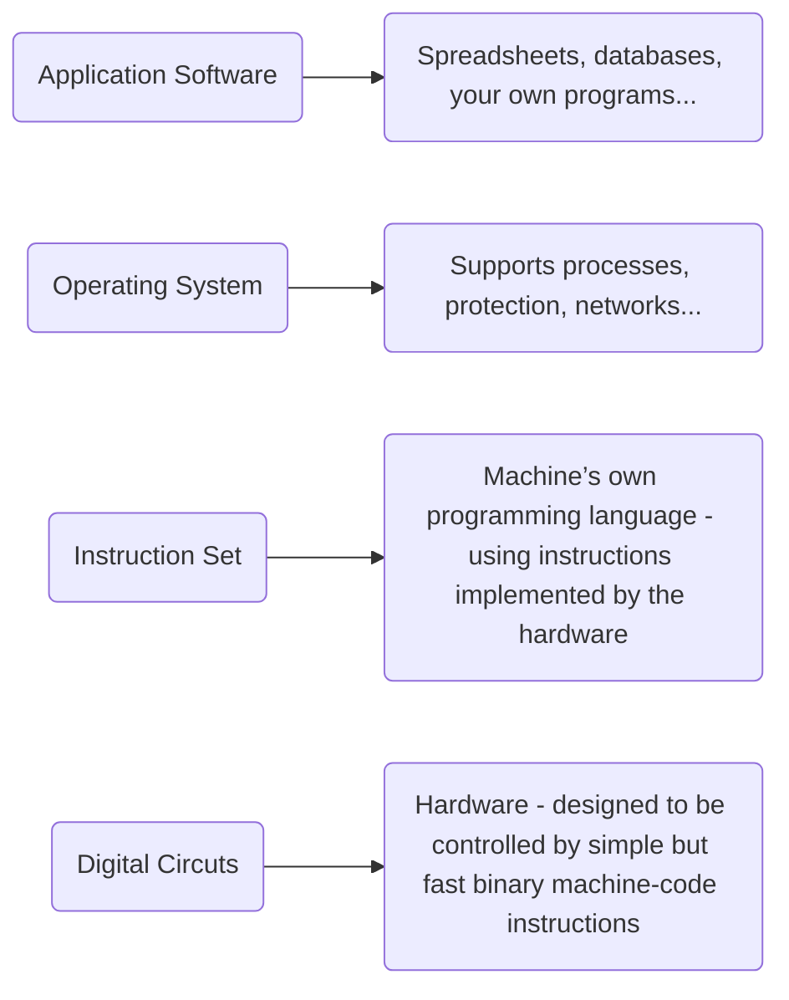
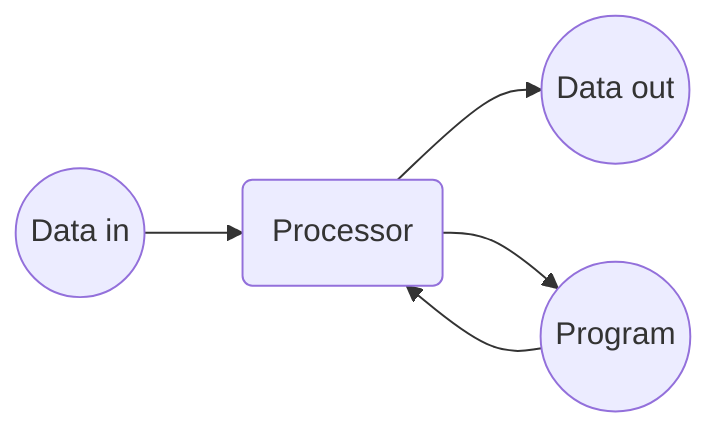
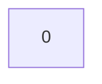

## Levels of Abstraction



## Computers

A computer is a machine that executes sequences of instructions (programs) which direct it to operate on (process) data.



- Strength: generality. Program instructs hardware to process incoming data in any chosen way.

## Different Kinds of Computers

- Personal computer - Variety of formats to support users directly (usually just one user or one at a
  time): desktop, laptop, tablet, phone, “wearable”.
- Server
  - Designed to run services handling requests from many networked clients simultaneously (e.g. web server, file server, email server, etc.)
- Embedded computer
  - A component that adds functionality to a bigger machine.
  - E.g. engine management unit in a car.
- High performance computer
  - Use many processors that cooperate to solve large scale problems.
  - May be a single machine with many processors (CPUs) or consist of many computers cooperating over a network.

## Numbers and Data

- Humans model external reality using mental concepts.
- These concepts are abstract mental entities not physical things, although they may
  represent physical things.
- Amongst the most useful of our concepts are numbers. Like all mathematical entities, numbers are abstract concepts: i.e. they do not represent physical things, the way more concrete concepts do (e.g. a computer, a desk etc.).
  - Numerals, symbols representing numbers, are concrete but not numbers themselves.
- Numbers are especially useful because the mathematical operations which can be performed on them (addition, sorting etc.) help us model and manipulate reality.
- These operations are also abstract and are themselves conceptual: they are initially conceived and performed in the mind. Adding, say, 2 + 3 is a mental process.
- Data (plural) arise from use of number in modelling reality. There are two mechanisms whereby this happens: labelling (which also implies counting) and measurement.
- While operating on data (aka processing) is not a physical activity (data are ultimately numbers and numbers are not physical) it can become too onerous for human abilities when data volumes are large: this is the motivation for seeking assistance from data processing machines. One of the earliest examples of such a device was the abacus.

## Data: Labelling and Measurement.

- Labelling. Take a set of items and map these onto whole numbers (0, 1, 2…etc) by assigning a different whole number to each one. If the elements have names, numbers can then be used interchangeably with the names.
  - E.g. Days of the week, with: Sunday = 0, Monday =1, …, Saturday = 6.
  - Such a mapping from names to numbers is called a code. Two days are never given the same number.
  - Other codes for same set are equally good. E.g. Sunday = 1,…, Saturday = 7.
- Measurement. Measuring some physical quantity with a measuring instrument.
  - These result in numbers with fractional (decimal) parts, often called real numbers.
  - In theory, a measurement can take any value between (usually obvious) limits but, in practice, this is restricted by accuracy of instrument so, in fact, the set of outcomes is finite.
  - E.g. measuring a length with a ruler is usually accurate to about .001m.
- Results of labeling and measurements are data items. Data are just sequences of data items.
- A set of data items under discussion at a given time forms a data set.
- Some data sets are clearly finite (e.g. the days of the week), others may look infinite at first sight but, in reality, are finite too (e.g. possible values for temperature of the room using a particular thermometer).

## Representations

- Despite the name, data-processing machines do not process data because machines are physical and data (being numbers) are not.
- Data representation involves finding suitable physical quantities to represent numbers.
  - need representations that can be stored (memory) in physical devices, communicated between devices and manipulated so as to mimic abstract data operations (like addition).
- In current technology electrical voltages are most commonly used.
  - Easily stored and transmitted over wires.
  - Other technologies are possible (e.g. optical).
- Computation involves designing devices to manipulate these physical representations in ways that map onto useful operations.
- Machines work with representations not with data.
  - so machines do not add numbers, they manipulate physical representations of numbers to mimic addition.
  - E.g in an abacus, groups of beads on a wire represent whole numbers and the process of moving the beads mimics addition.
- Many representations are possible for the same data.
- Two distinct approaches:
  - Analogue representations use continuous phenomena (measured to arbitrary accuracy)
  - Digital representations use discrete phenomena (finite number of allowed measurable values)

## Analogue Representations

- Analogue representations assign real numbers to continuous physical quantities
  - assumed measurable to arbitrary accuracy.
  - E.g. a real number x, could be represented by x metres or x volts.
- In reality physical measurement has limited accuracy and this limits the accuracy of the representation.
- Also, noise (fluctuations that add errors to the measurement) in the environment introduces errors which are hard to control.
- Analogue computers, once popular, have largely fallen out of use.
- E.g.: a slide rule uses length as the measurable quantity.

## Digital Representations

- Digital representations use discrete physical quantities.
- Current technology favours binary representations with two values of voltage,
- sometimes called low and high or false and true
- The values are often labelled 0 and 1 and called bits (BInary digits).
- Only need to be able to tell 2 values apart so superior resistance to noise errors.
  {: .right w="300" h="200"}
  - Only two values are valid and everything else the receiver sees is rounded to the nearest of these.
  - E.g. a low needs a substantial upward spike of noise to be seen as a high.
  - The further apart the low and high are the more resistance to noise is.
- Can represent as many data items as required using sequences of bits called code words.
- With 2 bits there are 4 possibilities (00, 01, 10, 11); with 3 bits 8 possibilities and so on.

## Binary Codes

- A mapping from a data set to binary code words is called a binary code.
  {: w="400" h="300"}
- Many codes can be defined on the same data set.
- Can represent any finite data set fully by using enough bits
- Can even represent real numbers to any desired degree of accuracy (by
  using long enough code words).
- If all the code words have the same number of bits, code is fixed length.

## Programs

- Computers are general artificial data processing machines that can perform sequences of operations under the control of a pre-prepared program.
- A program is a set of instructions detailing how input data should be processed to achieve a desired result (output data).
- Instructions can be numbered: so a program can also be numerically represented.
- Programs may themselves be treated as data by other programs (e.g. a compiler).
- Programs can be represented in hardware in the same way as data.
- Needs a machine able to interpret and execute the instructions in the program.

## Computer Storage

There is a basic digital circuit that can



- Take a data bit and store it
- Remember the value indefinitely
- Read out the stored value

The computer’s memory consists of a large number of these basic circuits.

Think of a bit storage circuit as a box that

- contains one bit
- can read out its contents
- can store a new bit value

This hardware behaves much like a variable in a high-level language (HLL) like Java or C.

## Bytes

A byte is a string of 8 bits, e.g. 01101001

A byte is represented in the computer by 8 copies of the basic bit storage circuit.

| 0 | 1 | 1 | 0 | 1 | 0 | 0 | 1 |

There are exactly 28 = 256 different values that can be represented in a byte (see right).

|     |     |     |     |     |     |     |     |
| :-: | :-: | :-: | :-: | :-: | :-: | :-: | :-: |
|  0  |  0  |  0  |  0  |  0  |  0  |  0  |  0  |
|  0  |  0  |  0  |  0  |  0  |  0  |  0  |  1  |
|  0  |  0  |  0  |  0  |  0  |  0  |  1  |  0  |
|  0  |  0  |  0  |  0  |  0  |  0  |  1  |  1  |
| ... |
|  1  |  1  |  1  |  1  |  1  |  1  |  1  |  1  |

Many different ways to utilise the information capacity of a byte.

## Words

A word is a larger amount of information. One common convention:

```
Short word  16 bits  2 bytes
Word       32 bits  4 bytes
Long word  64 bits  8 bytes

```

The term “32 bit architecture” means that the internal hardware uses 32-bit words

A word containing k bits is called a k-bit word, and can represent 2k distinct values.

| Word Size | Number of Values                  | Approx. |
| --------- | --------------------------------- | ------- |
| 8         | 2^8 = 256                         | 102     |
| 16        | 2^16 = 65,536                     | 105     |
| 32        | 2^32 = 4,294,967,296              | 109     |
| 64        | 2^64 = 18,446,744,073,709,551,616 | 101     |

Each CPU will have a characteristic word size which it can store and manipulate in a single
instruction. Early machines used 8-bits; today the norm is 64-bits.

## Transmitting binary: wires

- To manipulate binary representations in real devices need to connect components.
  - In electronic devices this is done by conducting wires.
  - Each wire can represent one bit at a time (as a high or low voltage between wire & ground).
- A bit (H or L) is forced onto one end of wire by a line driver (output) in the sending component…
  
- …and detected by a line receiver (input) in the receiving component
- 
- Multiple bits can be sent in sequence over the same wire, but one at a time:
  - A bit must be kept steady on the wire for a minimum bit time to be properly detected be receiver.
  - bit time varies according to the technology.
- To carry n-bits, can use one wire (serial transmission) taking n bit times, or n wires running
  in parallel (parallel transmission) taking 1 bit time. This arrangement is called an n-bit bus.

## Basic Components

- A 1-bit memory (build into n-bit registers to store binary code words)
  

- Note: register is the hardware: byte/word is the content.
- In addition to storage, we need physical devices to perform useful operations on bits and on
  code words. Examples:
  - Inverter (or NOT gate)
    - One wire in, one wire out, flips input bit (H → L, L →H)
  - n-bit adder (see later)
    - E.g. n = 4. Takes in two 4-bit codewords, treating them as numbers and generates 4- bit codeword of the sum.
    - Say, “adding” 2 + 5
    - 

## A Final Note on Codewords

- A binary digital computer memory contains only physical quantities that we can think of as 1s and 0s, organised into binary codewords that represent data or programs.
- But just looking at the codewords stored in a computer cannot tell you what code is being used.
  - E.g. 1001 may represent any one of a number (e.g. 9 in one code), a different number in another code (e.g. -7); a letter (e.g. “q”), a month (e.g. September), an instruction (e.g. MULTIPLY), or many other things.
  - Which one it is, is determined by the context.
  - This information must be supplied by the person who designed the hardware or the software, typically an engineer or a programmer.


