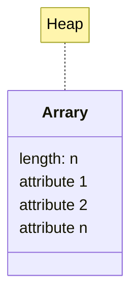
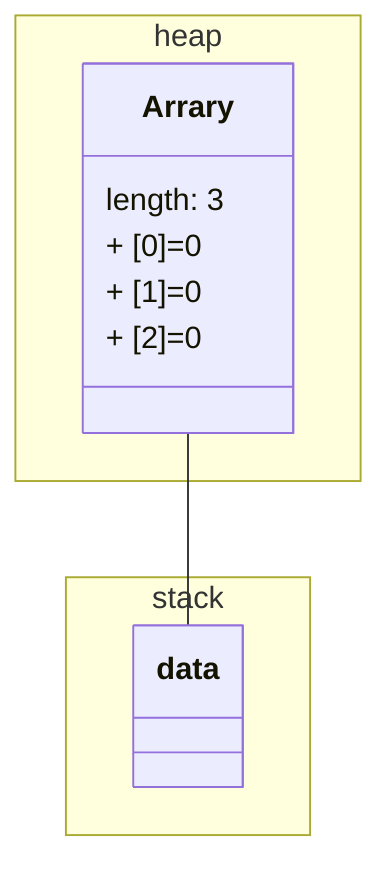

## 什么是数组？

- 数组是一种引用数据类型
  - 在内存中的存储示意图



- `int [] data = new int [3]`



- 数组是一组数据的集合
- 数组元素的类型可以是基本类型，也可以是引用类型，**但同一个数组只能是同一种类型**
- 数组的长度在数组对象创建后就确定了，就无法再修改了

数组中存储元素的类型是统一的，每一个元素在内存中所占的空间大小是相同的，知道数组的首元素的内存地址，要查找的元素只要知道下标就可以快速计算出偏移量，通过首元素内存地址加上偏移量快速计算出要查找元素的内存地址，通过内存地址快速定位该元素，所以数组查找元素的效率较高。

随机的对数组进行增删元素，当增加元素的时候，为了保证数组中元素在空间存储上是有序的，所以被添加元素位置后面的所有元素都要向后移动，删除元素也是，后面所有的元素也要向前移动。所以数组的增删元素的效率很低。

## 一维数组的声明和使用

```java
        //声明一个一维数组，用来存储int类型
        int[] a1 = {100, 200, 150, 300}; //静态初始化
        //boolean类型的数组
        boolean[] b = {true, false, true};
        //String类型数组
        String[] str = {"A", "B", "C"};
        //byte数组
        byte[] b2 = {1, 2, 3};
        //char数组
        char[] c1 = {'a', 'b', 'c'};
        //Object数组
        Object[] o1 = new Object();
```

### 初始化一维数组有两种方式

- 静态初始化

```java
public class ArrayTest02 {
    public static void main(String[] args) {
        //静态初始化一个int类型的一维数组
        int[] a1 = {10, 12, 31};
   }
}
```

- 动态初始化

```java
        //动态声明一个int类型的数组，最多可以存储4个元素
        int[] a1 = new int[4];
```

- 数组的操作

```java
        //取得第一个元素
        System.out.println("第一个元素：" + a1[0]);
        System.out.println("最后一个元素：" + a1[2]);
        System.out.println("最后一个元素：" + a1[a1.length - 1]);
        //取得个数
        System.out.println("数组中元素的个数是：" + a1.length);
        //遍历一维数组
        for (int i = 0; i < a1.length; i++) {
            System.out.println(a1[i]);
        }
        //将第二个元素修改成100
        a1[1] = 100;
```

### 动态初始化一维数组详解

动态初始化一维数组，会先在堆内存中分配这个数组，并且数组中每一个元素都采用默认值。

```java
byte, short, int, long = 0;
float, double = 0;
boolean = false;
char \u0000;
引用 = null;
```

必须清楚数组为引用类型

```java
        //声明引用类型的数组
        Student[] student = new Student[2];
        //出现空指针
        //因为引用类型的数组，它采用 null 作为默认的初始化值 student[0].id = 1001;
        student[0].name = "张三";
```

修正

```java
        //声明引用类型的数组
        Student[] student = new Student[2];
        //初始数组元素为 Student 对象
        student[0] = new Student();
        student[0].id = 1001;
        student[0].name = "张三";
        student[1] = new Student();
        student[1].id = 1002;
        student[1].name = "李四";

        //可以采用如下方式赋值
        Student zhangsan = new Student();
        zhangsan.id = 1001;
        zhangsan.name = "张三";
        student[0] = zhangsan;
```

### 动态初始化和静态初始化的区别

什么时候使用动态初始化？什么时候使用静态初始化？

1. 无论是动态还是静态初始化，最终的内存分布都是一样的。
2. 如果在创建数组的时候，知道数组中应该存储什么数据，这个时候当然采用静态初始化方式。
3. 如果在创建数组的时候无法预测到数组中存储什么数据，只是先开辟空间，则使用动态初始化方式。

### 深入一维数组

```java
public class ArrayTest05 {
    public static void main(String[] args) {
        //创建一个数组，这个数组既可以存储Dog，也可以存储Cat
        Animal[] animal = new Animal[4];

        //给数组每个元素赋值
        Dog d1 = new Dog();
        Dog d2 = new Dog();
        Cat c1 = new Cat();
        Cat c2 = new Cat();
        animal[0] = c1;
        animal[1] = d1;
        animal[2] = c2;
        animal[3] = d2;

        //需求：遍历数组，取出每个对象，如果是Dog执行eat方法，如果是Cat执行run方法
        for (int i = 0; i < animal.length; i++) {
            Animal a = animal[i];
            //强制类型转换（向下转型）
            if (a instanceof Cat) {
                Cat c = (Cat) a;
                c.run();
            } else if (a instanceof Dog) {
                Dog d = (Dog) a;
                d.eat();
            }
        }
    }
}

class Animal {
}

class Dog extends Animal {
    public void eat() {
        System.out.println("Dog eats");
    }
}

class Cat extends Animal {
    public void run() {
        System.out.println("Cat runs");
    }
}
```

### main 方法中 String [] args 详解

String [] args 是专门用来接收命令行参数的。

- 例如：java ArrayTest07 abc def aaa

JVM 在调用 main 方法之前，先将“abc def aaa”这个字符串以空格的方式分割，然后存储在 String 数组中。

```java
public class ArrayTest07 {
    //main方法中的String[]数组设计主要是用来接收命令行参数的
    public static void main(String[] args) {
        System.out.println("String类型的数组中元素的个数是：" + args.length);
        //遍历
        for (int i = 0; i < args.length; i++) {
            System.out.println(args[i]);
        }

        //需求:运行该软件的时候必须提供用户名和密码
        //格式: java ArrayTest07 username password
        //如果用户没有提供足够的参数，则系统退出
        if (args.length != 2) {
            System.out.println("想要使用该系统，必须这样输入：java ArrayTest07 username password");
            return;
        }
        //参数提供正确，如果用户名是admin,密码是123则登陆成功
        String username = args[0];
        String password = args[1];

        //java中比较字符串是否相等，必须使用equals方法
        //String类型是SUN提供，已经将equals重写了，比较的是内容
        if ("admin".equals(username) && "123".equals(password)) { //引号""放在前面可以避免空指针异常
            System.out.println("登陆成功，欢迎[" + username + "]回来");
        } else {
            System.out.println("登陆失败，用户名[" + username + "]不存在或者密码错误");
        }
    }
}
```

### 数组的拷贝，扩容详解

```java
public class ArrayTest08 {
    public static void main(String[] args) {
        //System.arraycopy (原数组，原数据的开始下标，目标数组，目标数组的开始下标，拷贝的长度)；
        int[] src = {2, 3, 4, 5, 6, 78, 88};
        int[] dest = {11, 13, 42, 5, 6, 7, 5, 333, 2};

        //执行System.arraycopy(src, 2, dest, 3, 3); 将src数组中索引2开始的3个元素（4, 5, 6）复制到dest数组的索引3位置开始，因此dest数组的一部分会被覆盖。
        System.arraycopy(src, 2, dest, 3, 3);
        for (int i = 0; i < dest.length; i++) {
            System.out.println(dest[i]); // 11 13 42 4 5 6 5 333 2
        }
    }
}
```

## 二维数组的声明和使用

二维数组属于多维数组，什么是多维数组？当数组元素的类型是数组时就成了多维数组。

- 静态初始化二维数组

```java
        
        //静态初始化二维数组
        int[][] a = {{1, 2, 3}, {45, 34, 33}, {0}, {10, 23, 66, 434}};
        
```

- 动态初始化二维数组

```java
        //3个一维数组
        //每个一维数组中有四个元素
        int[][] a = new int[3][4];
```

- 使用

```java
        //获取以上一维数组中元素的个数，以上这个数组有多少个一维数组
        System.out.println(a.length + "个一维数组");
        //获取第一个一维数组
        int[] a0 = a[0];
        int a00 = a0[0];
        System.out.println(a00);
        //获取第一个一维数组中的第一个元素
        System.out.println(a[0][0]);
        //获取最后一个一维数组中最后一个元素
        System.out.println(a[a.length - 1][a[a.length - 1].length - 1]);
        //遍历二维数组
        for (int i = 0; i < a.length; i++) {
            for (int j = 0; j < a[i].length; j++) {
                System.out.println(a[i][j]+" ");
            }
            System.out.println();
        }
```

### 冒泡排序

假设有 5 个数字 3，1，6，2，5 在一个 int 数组中，要求按从小到大排序输出。

首先从数组的最左边开始，取出第 0 号位置(左边)的数据和第 1 号位置(右边)的数据，如果左边的数据大于右边的数据，则进行交换，否而不进行交换。

接下来右移一个位置，取出第 1 个位置的数据和第 2 个位置的数据，进行比较，如果左边的数据大于右边的数据，则进行交换，否而不进行交换。沿着这个算法一直排序下去，最大的数就会冒出水面，这就是冒泡排序。

```java
public class BubbleSort {

    private int[] array;

    public BubbleSort(int[] array) {
        this.array = array;
    }
    /**
     * 从小到大
     */
    public void sort() {
        int length = array.length;
        if (length > 0) {
            for (int i = 1; i < length; i++) {
                for (int j = 0; j < length - i; j++) {
                    if (array[j] > array[j + 1]) {
                        int temp = array[j];
                        array[j] = array[j + 1];
                        array[j + 1] = temp;
                    }
                }
            }
        }
    }
}
```

### 选择排序

选择排序对冒泡排序进行了改进，使交换次数减少，但比较次数仍然没有减少。

假设有 5 个数字 3，1，6，2，5 在一个 int 数组中，要求按从小到大排序输出。

采用选择排序，选择排序是这样的，先从左端开始，找到下标为 0 的元素，然后和后面的元素依次比较，如果找到了比下标 0 小的元素，那么再使用此元素，再接着依次比较，直到比较完成所有的元素，最后把最小的和第 0 个位置交换。

```java
public class SelectSort {
    public static void main(String[] args) {
        int[] a = {3, 1, 6, 2, 5};

        //选择排序
        for (int i = 0; i < a.length - 1; i++) {
            //假设第一个数据是最小值
            //记录最小值元素的下标
            int min = i;

            for(int j =i;j<a.length;j++){
                if (a[min] > a[j]) {
                    //给min重新赋值
                    min = j;
                }
            }

            //考虑交换位置
            if (min != i) {
                int temp;
                temp = a[i];
                a[i] = a[min];
                a[min] = temp;
            }
        }
        //输出
        for (int i = 0; i < a.length; i++) {
            System.out.println(a[i]);
        }
    }
}
/*
3 1 6 2 5
第一次循环：
1 3 6 2 5

3 6 2 5
第二次循环：
2 6 3 5

6 3 5
第三次循环：

6 5
第四次循环：
5 6
 */
```

### 二分法(折半法)查找

查找数组中的元素我们可以遍历数组中的所有元素，这种方式称为线性查找。线性查找适合 与小型数组，大型数组效率太低。如果一个数组已经排好序，那么我们可以采用效率比较高 的二分查找或叫折半查找算法。

假设，我们准备采用二分法取得 10 在数组中的位置。

| 1 | 3 | 4 | 5 | 6 | 7 | 8 | 9 | 10 | 23 | 25 | 29 |

```java
public class MyArrays {
    public static void main(String[] args) {
        int[] a = {1, 3, 4, 5, 6, 7, 8, 9, 10, 23, 25, 29};
        int destElement = 10;
        //要求从a数组中查找10这个元素的下标
        int index = binarySearch(a, destElement); //如果找到则返回元素的下标，如果找不到则返回-1
        System.out.println((index == -1) ? destElement + "元素不存在！" : destElement + "在数组中的下标是：" + index);
    }

    //折半查找的核心算法
    public static int binarySearch(int[] a, int destElement) {
        int begin = 0;
        int end = a.length-1;

        while (begin<=end){
            int mid = (begin + end) / 2;
            if (a[mid]==destElement){
                return mid;
            } else if (a[mid] > destElement) {
                end = mid - 1;
            } else if (a[mid] < destElement) {
                begin = mid + 1;
            }
        }
        return -1;
    }
}
```

### Array.sort 的使用

```java
import java.util.Arrays;

public class ArraysUtilTest01 {
    public static void main(String[] args) {
        int[] data = {3, 1, 6, 2, 5};
        Arrays.sort(data);

        for (int i = 0; i < data.length; i++) {
            System.out.println(data[i]);
        }
    }
}
```

### Arrays.binarySearch 的使用

```java
import java.util.Arrays;

public class ArraysUtilTest02 {
    public static void main(String[] args) {
        int[] data = {3, 1, 6, 2, 5};
        Arrays.sort(data);

        for (int i = 0; i < data.length; i++) {
            System.out.println(data[i]);
        }

        int index = Arrays.binarySearch(data, 3);
        System.out.println("index=" + index);
    }
}
```


