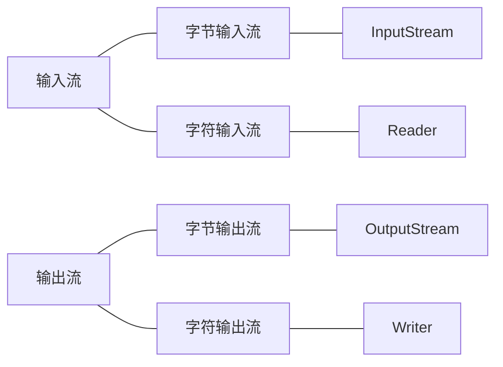

## 画图分析流的本质

## 什么是 IO 流？

文件通常是由一连串的字节或字符构成。

- 组成文件的字节序列称为**字节流**
- 组成文件的字符序列称为**字符流**

Java 中根据流的方向可以分为输入流和输出流。

- 输入流是将文件或其它输入设备的数据加载到内存的过程
- 输出流是将内存中的数据保存到文件或其他输出设备

## UML 表示 Input_OutputStream 的继承结构图

## UML 表示 Reader 和 Writer 的继承结构图

## 需要重点掌握的 16 个流

- FileInputStream
- FileOutputStream
- FileReader
- FileWriter

- BufferedReader
- BufferedWriter
- BufferedInputStream
- BufferedOutputStream

- DataInputStream
- DataOutputStream
- ObjectInputStream
- ObjectOutputStream

转换流（字节流转换成字符流）

- InputStreamReader
- OutputStreamReader

- PrintWriter
- PrintStream //标准的输出流（默认输出到控制台）

## InputStream (字节输入流)

InputStream 是字节输入流，InputStream 是一个抽象类，所有继承了 InputStream 的类都是字节输入流。

## OutputStream (字节输出流)

所有继承了 OutputStream 都是字节输出流。

## Reader (字符输入流)

所有继承了 Reader 都是字符输如流。

## Writer (字符输出流)

所有继承了 Writer 都是字符输出流。
