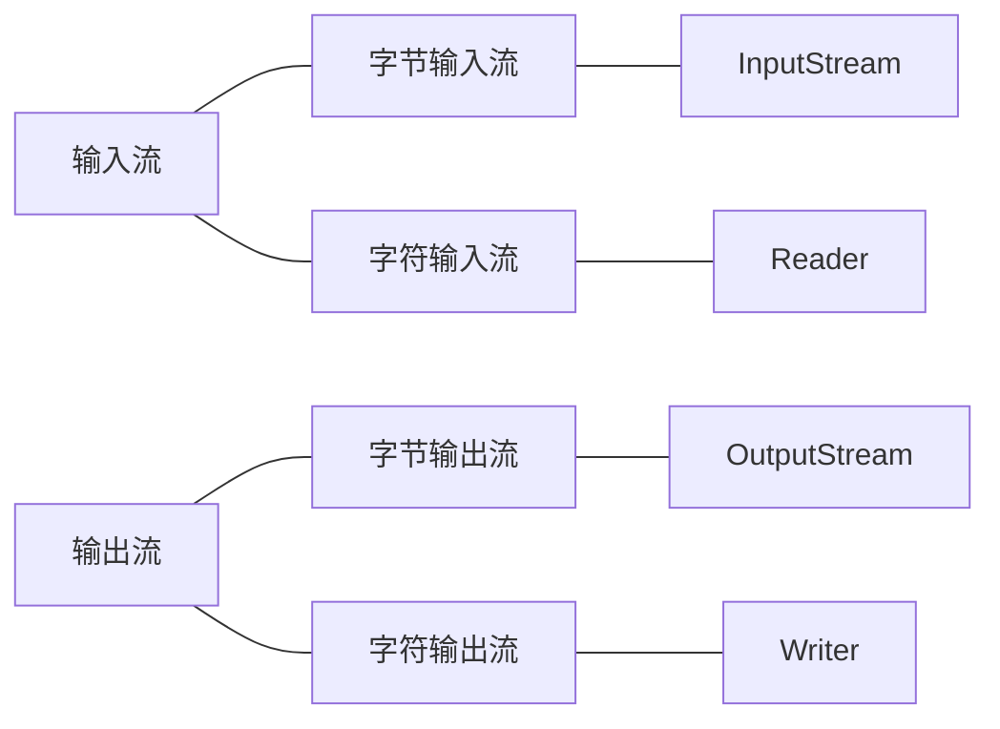

## 画图分析流的本质


## 什么是 IO 流？

文件通常是由一连串的字节或字符构成。

- 组成文件的字节序列称为**字节流**
- 组成文件的字符序列称为**字符流**

Java 中根据流的方向可以分为输入流和输出流。

- 输入流是将文件或其它输入设备的数据加载到内存的过程
- 输出流是将内存中的数据保存到文件或其他输出设备



## UML 表示 Input_OutputStream 的继承结构图


## UML 表示 Reader 和 Writer 的继承结构图


## 需要重点掌握的 16 个流

- `FileInputStream`
- `FileOutputStream`
- `FileReader`
- `FileWriter`

- `BufferedReader`
- `BufferedWriter`
- `BufferedInputStream`
- `BufferedOutputStream`

- `DataInputStream`
- `DataOutputStream`
- `ObjectInputStream`
- `ObjectOutputStream`

转换流（字节流转换成字符流）

- `InputStreamReader`
- `OutputStreamReader`

- `PrintWriter`
- `PrintStream` //标准的输出流（默认输出到控制台）

## InputStream (字节输入流)

`InputStream` 是字节输入流，`InputStream` 是一个抽象类，所有继承了 `InputStream` 的类都是字节输入流。

### FileInputStream

按照字节方式读取文件。

```java

public class FIleInputStreamTest01 {

    public static void main(String[] args) {

        FileInputStream file = null;
        //1. 要读取某文件，先与这个文件创建一个输入流
        //文件路径
        String filePath = "";//相对路径，相对当前而言，在当前路径下找
        String filePath1 = "D:\\005_Documents\\DailyShit.txt";//绝对路径
          try {
            file = new FileInputStream(filePath1);

            //.开始读
            int i1 = file.read(); //以字节方式读取
            int i2 = file.read();
            int i3 = file.read();
            int i4 = file.read();
            int i5 = file.read();
            int i6 = file.read();
            int i7 = file.read();

            System.out.println(i1); //97
            System.out.println(i2); //98
            System.out.println(i3); //99
            System.out.println(i4); //100
            System.out.println(i5); //101
            System.out.println(i6); //102
            System.out.println(i7); //-1 //如果已经读取到文件的末尾，就会返回-1

        } catch (FileNotFoundException e) {
            e.printStackTrace();
        } catch (IOException e) {
            e.printStackTrace();
        }

        //为了保证流一定会释放，所以在finally语句块中执行
        finally {
            if (file != null) {
                try {
                    file.close();
                } catch (IOException e) {
                    e.printStackTrace();
                }
            }
        }
    }
}
```

以下程序存在缺点，频繁访问磁盘，伤害磁盘，并且效率低。

```java
public class FileInputStreamTest02 {
    public static void main(String[] args) throws Exception {
        //1. 创建流
        FileInputStream file = new FileInputStream("D:\\005_Documents\\DailyShit.txt");

        //2. 开始读
        while (true) {

            int temp = file.read();
            if(temp==-1) break;
            System.out.println(temp);
        }

        //升级循环
        int temp = 0;
        while ((temp = file.read()) != -1) {
            System.out.println(temp);
        }
        //3. 关闭
        file.close();
    }
}
```

`int read (byte[] bytes);`

读取之前在内存中准备一个byte数组，每次读取多个字节存储到byte数组中

一次读取多个字节，不是单字节读取了，效率高

```java
public class FileInputStreamTest03 {
    public static void main(String[] args) throws Exception {

        //1. 创建输入流
        FileInputStream file = new FileInputStream("D:\\005_Documents\\DailyShit.txt");

        //2.开始读
        //准备一个byte数组
        byte[] bytes = new byte[3]; //每一次最多读取3个字节

        //int read (byte[] bytes); 该方法返回的int类型的值代表的是：这次读取了多少个字节
        int i1 = file.read(bytes); //3
        //将byte数组转换成字符串
        System.out.println(new String(bytes)); //abc
        int i2 = file.read(bytes); //3
        System.out.println(new String(bytes)); //def
        int i3 = file.read(bytes); //1
        System.out.println(new String(bytes)); //gef

        System.out.println(new String(bytes,0,i3)); //g

        int i4 = file.read(bytes); //-1 已经到达文件末尾，返回-1

        System.out.println(i1);
        System.out.println(i2);
        System.out.println(i3);
        System.out.println(i4);
        //关闭
        file.close();
    }
}
```

循环读取（以下代码正式写的时候要使用try catch，参考上面第一个代码块）

```java
public class FileInputStreamTest04 {

    public static void main(String[] args) throws Exception {

        FileInputStream file = new FileInputStream("D:\\005_Documents\\DailyShit.txt");

        byte[] bytes = new byte[1024]; //每次读取1kb

        while (true) {
            System.out.println("=============================");
            int temp = file.read(bytes);
            if (temp == -1) break;

            //将byte数组中有效的数据转换成字符串
            System.out.println(new String(bytes,0,temp));
        }

        //升级循环
        int temp = 0;
        while ((temp = file.read(bytes)) != -1) {
            System.out.print(new String(bytes,0,temp));
        }

        file.close();
    }
}
```

`available`和`skip`方法（以下代码正式写的时候要使用try catch，参考上面第一个代码块）

```java
public class FileInputStreamTest05 {
    public static void main(String[] args) throws Exception {

        //1. 创建流
        FileInputStream file = new FileInputStream("D:\\005_Documents\\DailyShit.txt");

        System.out.println(file.available()); //7

        file.read(); //97

        //int available () 返回流中剩余的估计字节数
        System.out.println(file.available()); //6

        //跳过2个字节
        file.skip(2);
        System.out.println(file.read()); //100

        //关闭
        file.close();
    }
}
```

## OutputStream (字节输出流)

所有继承了 `OutputStream` 都是字节输出流。

### FileOutputStream

`java.io.OutputStream`;

`java.io.FIleOutputStream`; 文件字节输出流

将计算机内存中的数据写入硬盘文件中

```java
public class FileOutputStreamTest01 {
    public static void main(String[] args) {

        //1. 创建文件字节输出流
        FileOutputStream file = null;
        try {
            //谨慎使用，会将原文件内容覆盖
  //          file = new FileOutputStream("D:\\005_Documents\\temp02.txt"); //该文件不存在则自动创建

            //以追加的方式写入
            file = new FileOutputStream("D:\\005_Documents\\temp02.txt", true);

            //2.开始写
            String msg = "Hello World";

            //将String转换成byte数组
            byte[] bytes = msg.getBytes();
            file.write(bytes);//将byte数组中所有的数据全部写入

            //将byte数组的一部分写入
            file.write(bytes,0,3);

            //推荐最后的时候为了保证数据完全写入硬盘，所以要刷新
            file.flush();

        } catch (Exception e) {
            e.printStackTrace();
        } finally {
            if (file != null) {
                try {
                    file.close();
                } catch (Exception e) {
                    e.printStackTrace();
                }
            }
        }
    }
}
```

`OutputStream`完成复制（以下代码正式写的时候要使用try catch，参考上面第一个代码块）

```java
public class Copy01 {

    public static void main(String[] args) throws Exception {

        //创建输入流
        FileInputStream fileInputStream = new FileInputStream("D:\\005_Documents\\temp02.txt");

        //创建输出流
        FileOutputStream fileOutputStream = new FileOutputStream("D:\\005_Documents\\temp03.txt");

        //一边读，一边写
        byte[] bytes = new byte[1024];
        int temp = 0;
        while ((temp = fileInputStream.read(bytes)) != -1) {
            //将byte数组中的内容直接写入
            fileOutputStream.write(bytes, 0, temp);
        }

        //刷新
        fileOutputStream.flush();

        //关闭
        fileInputStream.close();
        fileOutputStream.close();
    }
}
```

## Reader (字符输入流)

所有继承了 Reader 都是字符输入流。

### FileReader

`java.io.Reader`;

`java.io.InputStreamReader`; 转换流（字节输入流转换成字符输入流）

`java.io.FIleReader`; 文件字符输入流

```java
public class FileReaderTest01 {

    public static void main(String[] args) {

        //1. 创建文件字符输入流
        FileReader fr = null;

        try {
            fr = new FileReader("D:\\005_Documents\\DailyShit.txt");
            //2， 开始读
            char[] chars = new char[512]; //1kb

            int temp = 0;
            while ((temp = fr.read(chars)) != -1) {
                //将char数组有效部分转换成字符串
                System.out.println(new String(chars, 0, temp));
            }

        } catch (IOException e) {
            e.printStackTrace();
        } finally {
            if (fr != null) {
                try {
                    fr.close();
                } catch (Exception e) {
                    e.printStackTrace();
                }
            }
        }
    }
}
```

## Writer (字符输出流)

所有继承了 Writer 都是字符输出流。

### FileWriter

`java.io.Writer`;

`java.io.OutputStreamWriter`； 转换流（字节输出流 ——> 字符输出流）

`java.io.FileWriter`; 文件字符输出流（以下代码正式写的时候要使用try catch，参考上面第一个代码块）

```java
public class FileWriterTest01 {

    public static void main(String[] args) throws Exception {

        //创建文件字符输出流
//        FileWriter fw = new FileWriter("D:\\005_Documents\\temp02.txt"); //覆盖
        FileWriter fw = new FileWriter("D:\\005_Documents\\temp04.txt", true); //追加

        //开始写
        fw.write("张学友");

        //将char数组的一部分写入
        char[] chars = {'我','是','中','国','人','!','!','?','?','?'};

        fw.write(chars,0,5);

        //刷新
        fw.flush();

        //关闭
        fw.close();
    }
}
```

完成复制

只能复制纯文本文件（以下代码正式写的时候要使用try catch，参考上面第一个代码块）

```java
public class Copy02 {

    public static void main(String[] args) throws Exception {

        FileReader fr = new FileReader("D:\\005_Documents\\temp04.txt");
        FileWriter fw = new FileWriter("D:\\005_Documents\\temp05.txt");

        char[] chars = new char[512];
        int temp = 0;
        while ((temp = fr.read(chars)) != -1) {
            //写
            fw.write(chars, 0, temp);
        }

        fw.flush();
        fr.close();
        fw.close();
    }
}
```

## BufferedInputStream BufferedOutputStream BufferedReader BufferedWriter

字节

`BufferedInputStream` `BufferedOutputStream`

字符

`BufferedReader` `BufferedWriter` 带有缓冲区的字符输入\输出流

```java
public class BufferedReaderTest01 {
    public static void main(String[] args) throws Exception {

        //创建一个带有缓冲区的字符输入流
        FileReader fr = new FileReader("D:\\005_Documents\\DailyShit.txt");//创建一个文件字符输入流
        BufferedReader br = new BufferedReader(fr);//将文件字符输入流包装成带有缓冲区的字符输入流

        //根据流出现的位置，流又可以分为：包装流或者处理流和节点流
        //FileReader fr 是一个节点流
        //BufferedReader br 是一个包装流，或者处理流

        //把上面的写成一句话
        BufferedReader br = new BufferedReader(new FileReader("D:\\005_Documents\\DailyShit.txt"));

        //开始读
        String temp = null;
        while ((temp = br.readLine()) != null) { //br.readLine()方法读取一行，但是行尾不带换行符
            System.out.print(temp);//输出一行
        }

        //关闭
        //注意：关闭的时候住需要关闭最外层的包装流，（这里有一个装饰者模式）
        br.close();
    }
}
```

```java
public class BufferedReaderTest02 {
    public static void main(String[] args) throws Exception {
         //创建带有缓冲区的字符输入流
        FileInputStream fis = new FileInputStream("D:\\005_Documents\\DailyShit.txt");

        //转换流
        InputStreamReader isr = new InputStreamReader(fis);//isr是字符流
        BufferedReader br = new BufferedReader(isr);

        //将上面写成一句话
        BufferedReader br = new BufferedReader(new InputStreamReader(new FileInputStream("D:\\005_Documents\\DailyShit.txt")));

        //开始读
        String temp = null;
        while ((temp = br.readLine()) != null) {
            System.out.println(temp);
        }

        //关闭最外层的流即可（装饰者模式）
        br.close();
    }
}
```

`BufferedReader`接收用户键盘输入

```java
public class BufferedReaderTest03 {
    public static void main(String[] args) throws Exception {
        //以前的方式
        Scanner s = new Scanner(System.in); //System.in 是一个标准的输入流，默认接收键盘的输入

        //程序执行到此处停下来，等待用户的输入
        String str = s.next();
        System.out.println("您输入了： " + str);

        //使用BufferedReader用来接收用户的输入
        BufferedReader br = new BufferedReader(new InputStreamReader(System.in));

        //接收输入（每一次都接收一行）
        String temp = br.readLine();
        System.out.println("您输入了： " + temp);

        //关闭
        br.close();
    }
}
```

```java
public class BufferedWriterTest01 {
    public static void main(String[] args) throws Exception {

        //创建带有缓冲区的字符输出流
        BufferedWriter bw1 = new BufferedWriter(new FileWriter("D:\\005_Documents\\DailyShitTemp.txt"));

        BufferedWriter bw = new BufferedWriter(
            new OutputStreamWriter(
                new FileOutputStream("D:\\005_Documents\\DailyShitTemp.txt", true)));


        //开始写
        bw.write("奥运会！");

        //写入一个行分隔符
        bw.newLine();

        bw.write("开幕式一点都没意思！");

        //刷新
        bw.flush();
        //关闭
        bw.close();
    }
}
```

使用`BufferedReader`和`BufferedWriter`完成复制

```java
public class Copy03 {
    public static void main(String[] args) throws Exception {

        BufferedReader br = new BufferedReader(new FileReader("D:\\005_Documents\\DailyShitTemp.txt"));
        BufferedWriter bw = new BufferedWriter(new FileWriter("D:\\005_Documents\\DailyShitTemp1.txt"));

        String temp = null;
        while ((temp = br.readLine()) != null) {
            bw.write(temp);
            bw.newLine();
        }
        bw.flush();
        br.close();
        bw.close();
    }
}
```

## 装饰者模式详解

```java
public class AA {
    public void m1() {
        System.out.println("A's m1 method execute!!!");
    }
}

public class BB extends AA {
    //重写方法，注意：在源代码的基础之上的扩展
    public void m1() {
        System.out.println("扩展代码1");
        super.m1();
        System.out.println("扩展代码2");
    }
}

public class Test01 {
    public static void main(String[] args) {
        AA a = new BB();
        a.m1();
    }
}
```

以上代码有缺陷：关联程度强，致命弱点，有了继承关系，耦合度强

### 思考：对FileReader这个类的close方法进行扩展

1. 继承 （不推荐，代码耦合度太高，不利于项目的扩展）
2. 装饰者模式

```java
public class FileReader {
    public void close() {
        System.out.println("FileReader closed");
    }
}
```

使用`BufferedReader`对`FileReader`中的close方法进行扩展

1. 装饰者模式中要求：装饰者中含有被装饰者的引用
2. 装饰者模式中要求：装饰者和被装饰者应该实现同一个类型（接口）

```java
public abstract class Reader {
    public abstract void close();
}

public class FileReader extends Reader {
    public void close() {
        System.out.println("FileReader closed");
    }
}

public class BufferedReader extends Reader { //BufferedReader 装饰者
    //关联关系
    Reader reader; //FileReader就是被装饰者

    //Constructor
    BufferedReader(Reader reader) { //Reader reader = new FileReader(),多态
        this.reader = reader;
    }

    public void close() {
        //扩展
        System.out.println("扩展代码1");
        reader.close();
        System.out.println("扩展代码2");
    }
}

public class Test02 {
    public static void main(String[] args) {

        /*
        //1. 创建被装饰者
        FileReader fr = new FileReader();
        //2. 创建装饰者
        BufferedReader br = new BufferedReader(fr);
         */

        BufferedReader br = new BufferedReader(new FileReader());

        //3. 通过执行装饰者中的方法间接去执行被装饰者中的方法
        br.close();
    }
}
```

## DataInputStream && DataOutputStream

`java.io.DataOutputStream`; 数据字节输出流

可以将内存中的"int i = 10;" 写入到硬盘文件中，

写进去的不是字符串，写进去的是二进制数据，带类型

```java
public class DataOutputStreamTest01 {
    public static void main(String[] args) throws Exception {

        //创建数据字节输出流
        DataOutputStream dos = new DataOutputStream(new FileOutputStream("D:\\005_Documents\\DailyShitTemp2"));

        //准备数据
        byte b = 10;
        short s = 11;
        int i = 12;
        long l = 1000L;
        float f = 3.2f;
        double d = 2.3;
        boolean flag = false;
        char c = 'a';

        //写
        dos.write(b);
        dos.write(s);
        dos.write(i);
        dos.writeLong(l);
        dos.writeFloat(f);
        dos.writeDouble(d);
        dos.writeBoolean(flag);
        dos.writeChar(c);
        //刷新
        dos.flush();
        //关闭
        dos.close();
    }
}
```

```java
public class DataInputStreamTest01 {
    public static void main(String[] args) throws Exception {

        //创建输入流
        DataInputStream dis = new DataInputStream(
            new FileInputStream("D:\\005_Documents\\DailyShitTemp2" +
                ""));

        //读
        //注意：要使用该流读取数据，必须提前知道该文件中数据的存储格式，顺序
        //读的顺序必须和写入的顺序相同
        byte b = dis.readByte();
        short s = dis.readShort();
        int i = dis.readInt();
        long l = dis.readLong();
        float f = dis.readFloat();
        double d = dis.readDouble();
        boolean flag = dis.readBoolean();
        char c = dis.readChar();

        System.out.println(b);
        System.out.println(s);
        System.out.println(i);
        System.out.println(l);
        System.out.println(f);
        System.out.println(d);
        System.out.println(flag);
        System.out.println(c);

        //关闭
        dis.close();
    }
}
```

## PrintStream & PrintWriter

`java.io.PrintStream`; 标准的输出流，默认打印到控制台，以字节方式

`java.io.PrintWriter`: 以字符方式

```java
public class PrintStreamTest01 {

    public static void main(String[] args) throws Exception {

        //默认是输出到控制台的
        System.out.println("Hello World!");

        PrintStream ps = System.out;

        ps.println("JAVA......");

        //可以改变输出方向
        System.setOut(new PrintStream(
            new FileOutputStream("D:\\005_Documents\\log"))); //log日志文件
        //再次输出
        System.out.print("HAHA");

        //通常使用上面的这种方式记录日志
        //需求：记录日志，m1方法开始执行的时间和结束的时间，记录到log文件中
        SimpleDateFormat sdf = new SimpleDateFormat("yyyy-MM-dd:mm:ss SSS");
        System.out.println("m1方法开始执行 "+sdf.format(new Date()));
        m1();
        System.out.println("m1方法执行结束 "+sdf.format(new Date()));
    }

    public static void m1() {
        System.out.println("m1 method execute!");
    }
}
```

## ObjectInputStream ObjectOutputStream 对象的序列化

`java.io.ObjectOutputStream`; 序列化JAVA对象到硬盘 （Serial）

`java.io.ObjectInputStream`; 将硬盘中的数据反序列化到JVM内存 （DeSerial）

### 序列化

```java
import java.io.Serializable; //该接口是一个可序列化的
                            //该接口没有任何方法，是一个标志化接口
                            //像这样的接口还有：java.lang.Cloneable;可克隆的
/*
标志接口的作用：起到标识的作用
JVM如果看到该对象实现了某个标识接口，会对它特殊待遇

疑问：User实现Serializable接口，JVM对它的特殊待遇是什么？
 */

public class User implements Serializable {
    String name;

    public User(String name) {
        this.name = name;
    }

    public String toString() {
        return "User[name" + this.name + "]";
    }
}

public class ObjectOutputStreamTest01 {
    public static void main(String[] args) throws Exception {

        //1.创建对象
        User u1 = new User("刘德华");

        //2.创建输出流（序列化流）（JVM中的java对象状态保存到硬盘中）
        ObjectOutputStream oos = new ObjectOutputStream(new FileOutputStream("D:\\005_Documents\\DailyShitTemp3))"));

        //3.写
        oos.writeObject(u1);

        //刷新
        oos.flush();
        //关闭
        oos.close();
    }
}

```

### 反序列化

```java
public class ObjectInputStreamTest01 {
    public static void main(String[] args) throws Exception {
        //创建反序列化流
        ObjectInputStream ois = new ObjectInputStream(new FileInputStream("D:\\005_Documents\\DailyShitTemp3))"));

        //反序列化
        Object o = ois.readObject();
        System.out.println(o);

        //关闭
        ois.close();
    }
}
```

### 序列化版本号 serialVersionUID

```java
public class User implements Serializable {
}

public class Test01 {

    public static void main(String[] args) throws Exception {
        ObjectOutputStream oos = new ObjectOutputStream(new FileOutputStream("D:\\005_Documents\\user.DBF"));

        User u =new User();
        oos.writeObject(u);
        oos.flush();
        oos.close();
    }
}

//反序列化
public class Test02 {

    public static void main(String[] args) throws Exception {

        ObjectInputStream ois = new ObjectInputStream(new FileInputStream("D:\\005_Documents\\user.DBF"));
        System.out.println(ois.readObject());

        ois.close();
    }
}
```

例1：Test01执行序列化完成后，删除user.DBF文件，此时再执行Test02程序，会报错

因为User实现了Serializable接口，JVM会特殊待遇：会给该类添加一个属性，

static final long serialVersionUID = 一个值;

当User类更新重新编译后，该属性会变化

```java
public class User implements Serializable {

    //不让系统自动生成，自己写一个序列化版本号
    static final long serialVersionUID = 1234567L;

    //如果不想让该属性参加序列化，需要使用transient关键字修饰
    transient String name;

    public User(String name) {
        this.name = name;
    }

    public String toString() {
        return "User[" + this.name + "]";
    }
}
```

## File

java.io.File

1. File类和流无关，不能通过该类完成文件的读和写
2. FIle是文件和目录路径名的抽象表示形式

File代表的是硬盘上的Directory和file

```java
public class Test01 {

    public static void main(String[] args) throws Exception {

        //path相对路径
        File f1 = new File("Test01.java");

        File f2 = new File("D:\\005_Documents\\user.DBF");

        File f3 = new File("D:\\005_Documents");

        System.out.println(f1.exists());
        System.out.println(f2.exists());
        System.out.println(f3.exists());

        File f4 = new File("D:\\005_Documents\\123");
        System.out.println(f4);

        //如果不存在创建
        if (!f4.exists()) {
            //创建目录
            f4.mkdir();
            //创建文件
            f4.createNewFile();
            //创建多重目录
            f4.mkdirs();
        }
    }
}
```

```java
public class Test02 {

    public static void main(String[] args) throws Exception {

        //1. 获取绝对路径
        File f1 = new File("D:\\005_Documents\\DailyShit.txt");

        String absolutePath = f1.getAbsolutePath();

        System.out.println(absolutePath);

        //2. 获取文件名
        System.out.println(f1.getName());

        //3. 获取父路径
        File f2 = new File("D:\\005_Documents\\DailyShit.txt");
        String parentPath = f2.getParent();
        System.out.println(parentPath);

        //4. 判断该File是Directory还是File
        System.out.println(f1.isDirectory()); //false
        System.out.println(f1.isFile()); //true

        //5. 获取文件最后一次修改时间
        System.out.println(f1.lastModified());

        //6. 获取文件的长度 (字节数)
        System.out.println(f1.length());

        //7. 列出子文件
        File f3 = new File("D:\\005_Documents");

        File[] fs = f3.listFiles();
        //遍历
        for (File f: fs ) {
            if (f.getAbsolutePath().endsWith(".txt")) {
                System.out.println(f.getAbsolutePath());
            }
        }
    }
}
```

使用递归，找出某目录下的所有子目录以及子文件

```java
public class Test03 {

    public static void main(String[] args) {

        File f = new File("D:\\005_Documents");

        //调用方法完成查找
        m1(f);
    }

    public static void m1(File file) {
        if (file.isFile()) {
        return;
        }
        //f有两种可能，f可能是文件，也可能是目录
        //先当作目录
        File[] fs = file.listFiles();
        for (File subF : fs) {
            System.out.println(subF.getAbsolutePath());
            m1(subF);
        }
    }
}
```
